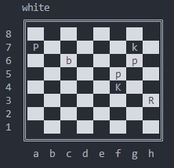

# libchess: Rust chess library

 
This library implements the game of chess: chess board, pieces, rules and legal moves.

## Examples


### Initializing a ChessBoard:
The easiest way to initialize the board is to use the FEN-string. Also, if you
need a default starting chess position you can use the ::default() method:
```rust
use libchess::boards::ChessBoard; 

println!("{}", ChessBoard::default());  // draw the starting chess position

let fen = "8/P5k1/2b3p1/5p2/5K2/7R/8/8 w - - 13 61";
let board = ChessBoard::from_str(fen).unwrap();  // the board could be initialized from fen-string

println!("{}", board);  // this will draw the board representation in terminal:
```



*Here uppercase letters represent whites' pieces and lowercase - blacks'.*


```rust
println!("{}", board.render_flipped());  // or you can render this board from black's perspective (flipped)
println!("{}", board.as_fen());  // will return a FEN-string "8/P5k1/2b3p1/5p2/5K2/7R/8/8 w - - 13 61"
```


### Initializing a Game object:
```rust
use libchess::*;
use libchess::{PieceType::*, boards::squares::*};

// initializing the game is almost the same as for boards
let mut game = Game::from_fen("3k4/3P4/4K3/8/8/8/8/8 w - - 0 1").unwrap();  

let moves = vec![mv!(King, E6, D6)];  // defining vec of chess moves to be applied to the board
for one in moves.iter() {
    game.make_move(Action::MakeMove(*one)).unwrap();
}
assert_eq!(game.get_game_status(), GameStatus::Stalemate);
```


### Making moves:
```rust
use libchess::*;
use libchess::{PieceType::*, boards::squares::*};

let mut game = Game::default();
let moves = vec![
   mv!(Pawn, E2, E4),
   mv!(Pawn, E7, E5),
   mv!(Queen, D1, H5),
   mv!(King, E8, E7),
   mv!(Queen, H5, E5),
];

for one in moves.iter() {
    game.make_move(Action::MakeMove(*one)).unwrap();
}
assert_eq!(game.get_game_status(), GameStatus::CheckMated(Color::Black));
```

Also you can define moves by str: 
```rust
use libchess::*;
use libchess::{PieceType::*, boards::squares::*};
use std::str::FromStr;

let mut game = Game::default();
let moves = vec![
    "e2e4", "c7c5",
    "Ng1f3", "d7d6",
    "d2d4", "c5d4",
    "Nf3d4", "Ng8f6",
];

for m in moves.iter() {
    game.make_move(Action::MakeMove(mv_str!(m))).unwrap();
}
println!("{}", game.get_position());
```


### Game history representation:
```rust
println!("{}", game.get_action_history());
```


*This library was inspired by other interesting and, obviously, more powerful chess libraries written in Rust:*
* [Chess](https://github.com/jordanbray/chess)
* [Shakmaty](https://crates.io/crates/shakmaty)
